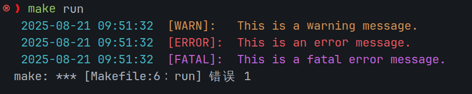
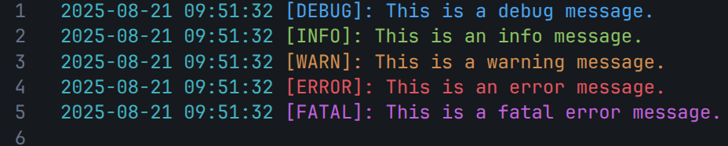

# TimmoLog
## 运行
在终端使用命令`make run`即可观测输出结果(Markdown不支持颜色输出)

终端显示效果如下

日志文件显示效果如下：

## 说明
本日志系统支持五级日志输出，其中`debug、info`不会输出在终端中，只会输出在指定的日志文件中
`log_fatal`会直接停止程序，类似于`assert`，所以在使用`make`命令运行时会报错
可以调用C语言库中的`__LINE__、__FILE_NAME__`，方便快速定位出错文件